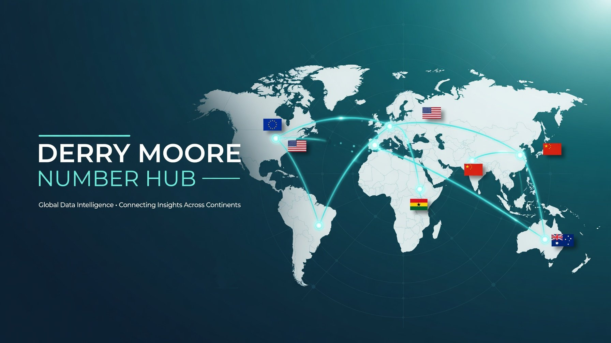

# Derry Moore Number Hub

A modern, professional website for **Derry Moore Number Hub** — your trusted gateway to international phone numbers across Europe, America, Africa, Asia, and Australia.



## 🌍 Features

- **Global Reach** – 5 major regions with flag cards:
  - Europe
  - America
  - Africa
  - Asia
  - Australia

- **Contact Integration**
  - Phone: +233 501 185 921
  - WhatsApp: +233 242 806 605

- **International Partners** – 19 foreign communication platforms with logos:
  - WhatsApp, Telegram, Signal, Skype, Google Voice, Messenger, Viber, Zoom, Slack, Microsoft Teams, Discord, LINE, WeChat, Twilio, LinkedIn, Instagram, POF, eHarmony, PayPal, Venmo, Cash App


- Beautiful responsive design with Tailwind CSS
- Smooth animations and mobile-friendly navigation

## 📁 Project Structure

```
├── index.html          # Main website
├── README.md           # This file
├── banner.jpg          # Hero banner image
└── (images/ folder can be added for future assets)
```

## 🚀 Getting Started

1. Open `index.html` in any modern browser
2. No build step required — fully static website
3. All contact buttons are live and functional

## 🛠 Technologies Used

- HTML5 + Tailwind CSS (via CDN)
- Font Awesome 6.5.1
- Vanilla JavaScript

## 📞 Contact

- **Telephone**: +233 501 185 921
- **WhatsApp**: +233 242 806 605

---

**Built with ❤️ for Derry Moore Number Hub**  
Ghana • 2026

---

> **Note**: This is a fully functional static website. You can easily host it on GitHub Pages, Netlify, or any web server.